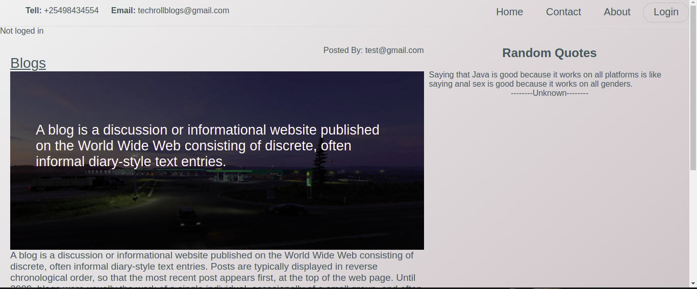

### PROJECT TITLE : BLOG_APP
### AUTHOR: UHURU OTIENO RAWLINGS
### PROJECT DESCRIPTION
This is a flask  blog app that allows user to post blogs, its writen in flask python with html, javascript and css. The project also consumes an API [http://quotes.stormconsultancy.co.uk/random.json](http://quotes.stormconsultancy.co.uk/random.json). This API serve the purpose of  rendering  random quotes.

### TECHNOLOGY USED
Python-Flask - This a python frame work that allows us to write web application using python
HTML - HYPER TEXT MAKE UP LANGUAGE - This provide a way to display web contents
CSS - Cascading Style Sheet - This was used to style the website
### USER STORY
1. As a user, I would like to view the blog posts on the site
2. As a user, I would like to comment on blog posts
3. As a user, I would like to view the most recent posts
4. As a user, I would like to an email alert when a new post is made by joining a subscription.
5. As a user, I would like to see random quotes on the site
6. As a writer, I would like to sign in to the blog.
7. As a writer, I would also like to create a blog from the application.
8. As a writer, I would like to delete comments that I find insulting or degrading.
9. As a writer, I would like to update or delete blogs I have created.

### APP SCREENSHORT

### SET UP INSTRUCTION